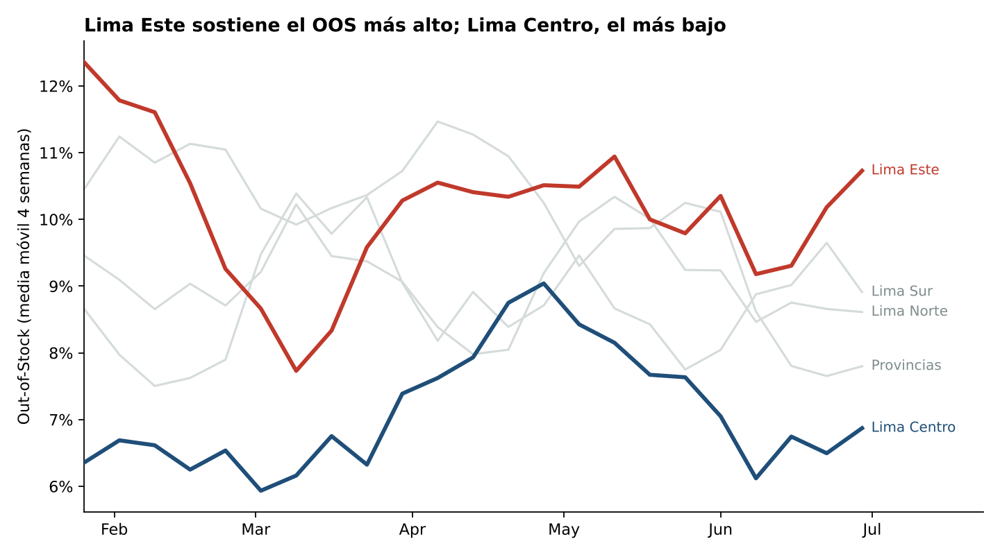
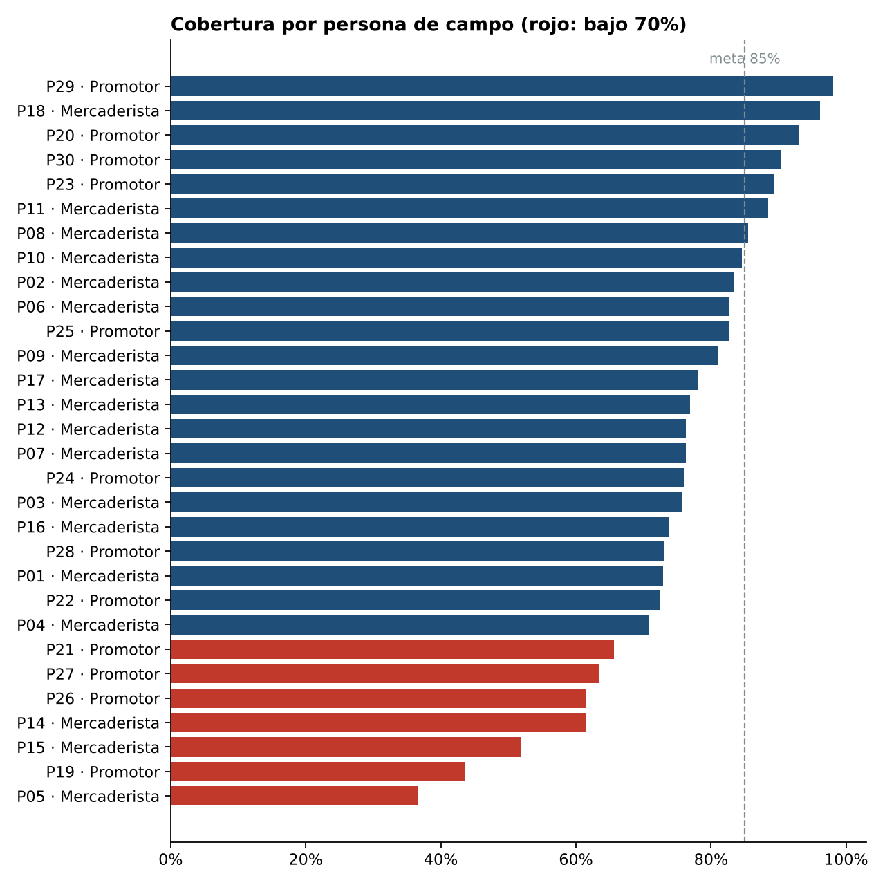
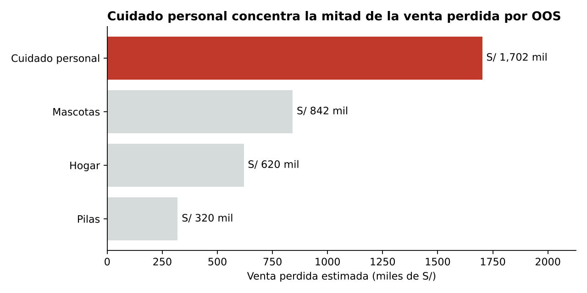

# Ejecución en Punto de Venta: cobertura, Out-of-Stock y venta perdida

> **Pregunta de negocio:** ¿cuánto sell-out pierde un fabricante de consumo masivo por quiebres de stock en góndola, y qué parte se explica por la disciplina de visitas de su fuerza de campo?

**Stack:** Python (Pandas, NumPy) · SQL (DuckDB) · Matplotlib · Plotly
**Datos:** 100% simulados (ver [`src/generate_data.py`](src/generate_data.py)). No contienen información de ninguna empresa o cliente real.

---

## Resultados clave

| KPI (26 semanas, 72 tiendas) | Resultado | Meta |
| --- | --- | --- |
| Cobertura de ruta | 75.6% | 85% |
| Out-of-Stock promedio | 9.0% | ≤ 6% |
| Cumplimiento de precio (±5% del sugerido) | 76.0% | 85% |
| Exhibición según planograma | 85.5% | — |
| Sell-out | S/ 51.4 M | — |
| **Venta perdida estimada por OOS** | **S/ 3.48 M (6.8% del sell-out)** | — |

### 1. Menos visitas, más quiebres
Las tiendas con cobertura menor a 70% tienen un OOS de **12.9%**, más del doble que las tiendas con cobertura de 85% o más (**6.0%**). La correlación entre cobertura y OOS es de **-0.89**.


### 2. El problema se concentra en zonas y personas concretas
Lima Este mantiene el OOS más alto durante casi todo el semestre, mientras Lima Centro el más bajo. 7 de 30 personas de campo ejecutan menos del 70% de sus visitas planificadas.





### 3. Dónde duele en soles
Cuidado personal concentra casi la mitad de la venta perdida (S/ 1.70 M) por su mayor precio unitario.



## Recomendaciones

1. **Reasignar rutas** de las 7 personas con cobertura < 70%, empezando por Lima Este.
2. **Priorizar Cuidado personal** en la checklist de reposición: es la categoría donde cada quiebre cuesta más.
3. **Alertas semanales automáticas** de tiendas con OOS > 10% para el supervisor de zona.
4. **Meta de cobertura de 85%**: llevar las tiendas de < 70% a ese nivel reduciría su OOS a la mitad, según la relación observada.

## Dashboard interactivo

[`dashboard/index.html`](dashboard/index.html) incluye tarjetas de KPI, dispersión por tienda con detalle al pasar el mouse, OOS semanal por zona, venta perdida por categoría y mapa de calor de cumplimiento de precio por cadena.
Descárgalo y ábrelo en el navegador, o míralo publicado en GitHub Pages si está activo en el repositorio.

## Modelo de datos

```
dim_tiendas ──┐                ┌── dim_sku
dim_personal ─┤                │
              ├── fact_visitas │   (semana, tienda, persona, visitas plan/ejec)
              ├── fact_auditoria ──(semana, tienda, sku, oos, precio, exhibición)
              └── fact_sellout ────(semana, tienda, sku, unidades, venta)
```

Los KPIs se calculan en SQL en [`sql/kpis.sql`](sql/kpis.sql): cobertura, OOS, cumplimiento de precio, scorecards por tienda y persona, y la estimación de venta perdida.

**Metodología de venta perdida:** para cada tienda y SKU se toma la venta semanal promedio cuando hubo stock. En las semanas con OOS, la diferencia entre ese promedio y la venta real se cuenta como venta perdida. Es una estimación conservadora: no incluye la pérdida de clientes que cambian de marca.

## Cómo reproducirlo

```bash
pip install -r requirements.txt
python src/generate_data.py   # genera los CSV en data/
python src/analysis.py        # KPIs, gráficos y dashboard
```

## Estructura

```
01-trade-marketing-pdv/
├── data/          # CSV simulados (dimensiones y hechos)
├── sql/kpis.sql   # vistas de KPIs
├── src/           # generación de datos y análisis
├── outputs/       # gráficos, scorecards y resumen_kpis.json
└── dashboard/     # dashboard HTML interactivo
```
