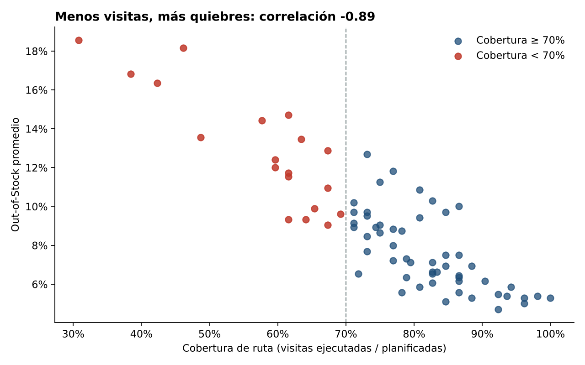

# Josué Valverde · Analista Comercial y de Datos

Analista Comercial y de Trade Marketing en Lima, Perú. Convierto datos de fuerza de ventas, sell-out y ejecución en punto de venta en decisiones comerciales, con dashboards en Power BI y pipelines en SQL, dbt y Python.

---

## Proyectos destacados

### 1. [Ejecución en punto de venta: cobertura, OOS y venta perdida](01-trade-marketing-pdv)
**Python · SQL (DuckDB) · Plotly**

Modelo de KPIs de trade marketing para 72 tiendas, 30 personas de campo y 40 SKU durante 26 semanas, con datos simulados.
- Estimé **S/ 3.48 M de venta perdida por quiebres de stock** (6.8% del sell-out).
- Demostré que las tiendas con cobertura menor a 70% duplican el OOS de las que superan 85% (12.9% vs. 6.0%).
- Dashboard interactivo con KPIs, scorecard por tienda y cumplimiento de precio por cadena.

**[▶ Ver dashboard en vivo](https://josuervp.github.io/JosueValverde_Analyst/01-trade-marketing-pdv/dashboard/)**

### 2. [Pipeline de datos de e-commerce con dbt y BigQuery](https://github.com/JosueRVP/gz-dbt-repository)
**dbt · BigQuery · SQL** · Le Wagon Data Analytics Bootcamp

Pipeline en tres capas (staging, intermediate, marts) que calcula el margen operativo diario de un e-commerce.
- 7 modelos y 28 nodos de modelos y tests de calidad (unique, not_null, relationships y tests de negocio).
- Mart `finance_days` con pedidos, ticket promedio, margen bruto y margen operativo.

---

## Otros proyectos

| Proyecto | Herramientas | Resultado |
| --- | --- | --- |
| Predicción de cumplimiento de SLA | Orange Data Mining, Machine Learning | Variables críticas que afectan el tiempo de respuesta técnica |
| Dashboard de marketing digital | Power BI, Power Query | ROAS, CPC, CPM y tendencias mensuales de Google Ads |
| Consolidación de reportes multifuente | Excel avanzado, Power Query | Reportes mensuales automatizados desde varios archivos planos |

## Stack

| Área | Herramientas |
| --- | --- |
| Business Intelligence | Power BI (DAX, Power Query), Looker Studio |
| Datos y modelado | SQL (BigQuery, PostgreSQL, DuckDB), dbt |
| Python | Pandas, NumPy, Scikit-learn, Matplotlib, Plotly |
| Comercial | Sell-in / sell-out, OOS, cobertura, pricing, segmentación RFM, forecast |

## Contacto

- LinkedIn: [linkedin.com/in/josue-valverde-pariasca](https://www.linkedin.com/in/josue-valverde-pariasca)
- Email: [josue97rafael@gmail.com](mailto:josue97rafael@gmail.com)
